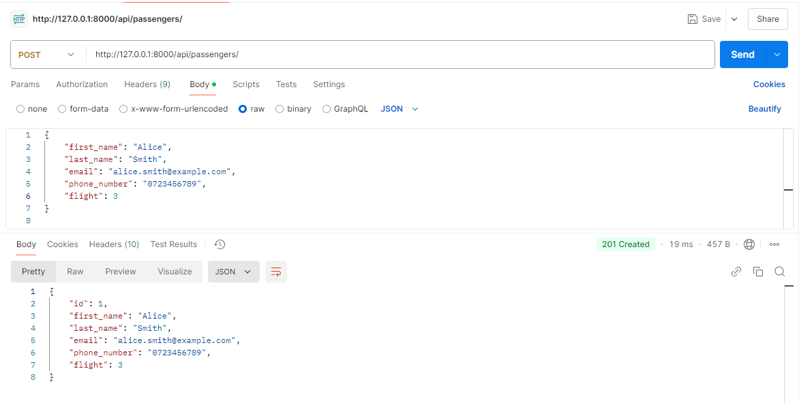

# Django Airline Booking System API

## **Project Description**

This is a simplified API for an airline booking system developed using the Django framework and Django Rest Framework (DRF). The API supports the management of flights and passengers, allowing users to perform CRUD (Create, Retrieve, Update, Delete) operations on these entities.

---

## **Setup Instructions**

Follow these steps to set up and run the project on your local machine:

1. **Clone the Repository**:

   ```bash
   git clone <repository_url>
   cd airline_booking_system
   ```

2. **Set Up a Virtual Environment** (optional but recommended):

   ```bash
   python -m venv venv
   source venv/bin/activate # On Windows: venv\Scripts\activate
   ```

3. **Install Dependencies**:

   ```bash
   pip install -r requirements.txt
   ```

4. **Apply Database Migrations**:

   ```bash
   python manage.py migrate
   ```

5. **Create a Superuser**:

   ```bash
   python manage.py createsuperuser
   ```

   Follow the prompts to set up a username, email, and password for the superuser.

6. **Run the Development Server**:
   ```bash
   python manage.py runserver
   ```
   The server will start on `http://127.0.0.1:8000/`.

---

#### Evidence of Tests

# Flights Endpoints:

- GET BY ID:
  .png>)
- GET ALL:
  
- POST:
  
- PUT:
  
- DELETE:
  

# Passengers Endpoint

- GET BY ID:
  .png>)
- GET ALL:
  .png>)
- POST:
  
- PUT:
  
- DELETE:
  

## **Future Enhancements**

- Add user authentication and permissions for secure access to endpoints.
- Include flight seat availability management.
- Implement a booking system for passengers to reserve seats.
